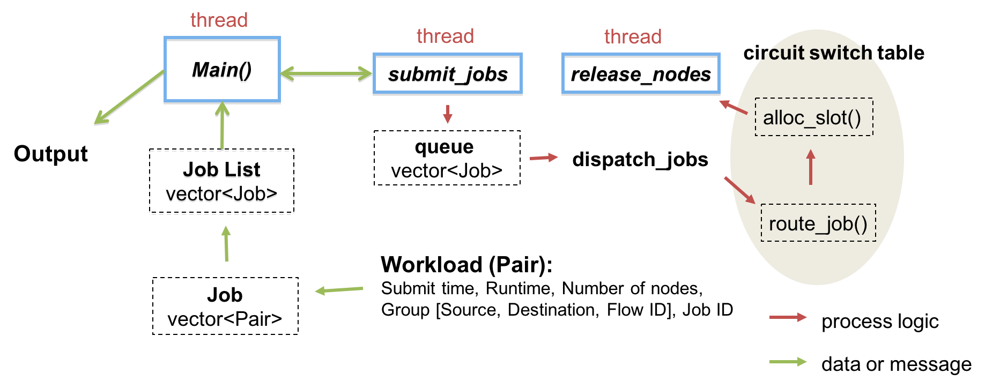

# circuit-switch-scheduler
This repo contains the work on job scheduling over circuit-switched network.
## Source Files
### [Makefile](Makefile)
* This file produces one executable file:
*css.out*, which is run as circuit switch scheduler (see details in [circuit-switch-scheduler.cc](circuit-switch-scheduler.cc))

* Simulation results are saved in output/, sorted by scheduling clocks (e.g., t1, t5, t7, t9,...)

* For each scheduling clock (showed in folder output/t*), there is one system log file (stat) and routing table for each switch (sw*)

#### Usage: 
```shell
$ make
$ cat workload.txt | ./css.out (parameters are as follows)
```

#### Parameters:

| Parameter | Note | Value |
| --- | --- | --- |
| **-T \<n\>** | Set topology | 0: Mesh, <br> 1: Torus, <br> 2: Fat Tree, <br> 3: Fully Connected, <br> 4: Dragonfly (FCC), <br> 5: Topology File |
| **-a \<n\>** | Set array size for mesh (-T 0) or torus (-T 1) | Integer <br> (defaultly 4) |
| **-n \<n\>** | Set the number of hosts to one switch for fat-tree (-T 2) | Integer <br> (defaultly 1) |
| **-u** | Allow to update a slot number (at intermediate switches on a path) |  |
| **-D \<n\>** | Set switch degree for mesh (-T 0) or torus (-T 1) | Integer <br> (defaultly 4) |
| **-d \<n\>** | Set switch ports (not include host) for dragonfly (-T 4) | Integer <br> (defaultly 8) |
| **-m \<n\>** | Set the number of switches in a group for dragonfly (-T 4) | Integer <br> (defaultly 4) |
| **-t \<filename\>** | Set topology file name (-T 5) | File name |
| **-s \<n\>** | Set the total number of slots in a switch | Integer <br> (defaultly 8) |

#### Example of workload file (e.g., workload.txt):

    #submit_time run_time node_num source destination flow_id job_id

    1 1 4 1 3 0 0
    1 1 4 2 4 1 0
    1 1 4 2 1 1 0
    1 1 4 3 4 2 0
    5 6 2 0 3 0 1
    7 3 8 5 6 0 2
    7 3 8 4 1 1 2
    7 3 8 3 5 2 2
    7 3 8 2 7 2 2
    7 3 8 6 8 2 2
    9 5 4 8 1 0 3
    9 5 4 2 9 0 3

### [circuit-switch-scheduler.cc](circuit-switch-scheduler.cc)
This program schedules the jobs (including flows and pairs) described in the workload file.

#### Program sketch:

<div align=center>

</div>
